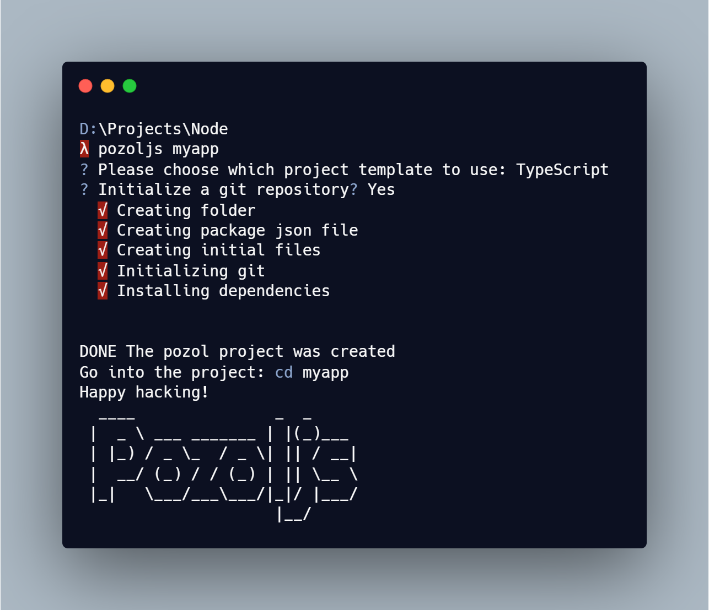

# Pozol CLI

Pozoljs is a package to initialize your node-express project with typescript or javascript and create full components to develop your backend apps faster.

Pozoljs will helps you to get a node-express project more escalable with a good estructure for folders and files.

Pozoljs is not a framework.

## Getting start

- [Installing](#installing)
- [Quick start](#quick-start)
- [The CLI](#the-cli)
  - [Some concepts](#some-concepts)
  - [Building your first project](#build-project)
  - [Files structure](#files-structure)
- [Pozoljs commands](#commands)
  - [Create component](#create-component)
  - [Create controller](#create-controller)
  - [Create service](#create-service)
  - [Create routes](#create-routes)
  - [Create interface](#create-interface)
- [About the project](#about-project)

## Installing the CLI :smile: <a name="installing"></a>
In your shell run, this is going to install pozoljs globally. When the package is installed, you will can use `pozoljs` command to create the initial project and other files.
```shell
npm install -g @daniel-cmorales/pozoljs
```

## Quick start :rocket: <a name="quick-start"></a>
Run the command into the directory where your project will be created.
```shell
pozoljs [projectName] --yes
```

## The CLI :book: <a name="the-cli"></a>

### Some concepts <a name="some-concepts"></a>

1. **Component:** it is a small folder that contains the principal modules of an endpoint. For example, you will make endpoints about users, so in the users folder you have controller, service, routes (and interface if it is a typescript project) files.
2. **Service:** it is the one of your files of your component. Service connect with the database or return data that you need. In other words, the service provides data to the controller. In the start, the service file implements findAll, findById, findOne, save, update and delete methods.
3. **Controller:** it is another file of your component. Controller manipualte the data that obtains of the service or of the route. The controller call service methods through dependencie injection.
4. **Route:** it is the important final file of your component. Here you can code the routes about your component like GET, POST, PUT or DELETE.
5. **Interface:** the interface is using in typescript like a data type.

### Building your first project using pozoljs <a name="build-project"></a>
1. Run the command into the path where your project will be created.
```shell
pozoljs [projectName]
```
2. Should choose the type project.
3. Choose if you want to initialize the project with git or not.
4. Finally pozoljs build the project and it is going to install initial dependencies



### Files Structure <a name="files-structure"></a>

Pozoljs builds a node/express project with and initial structure of the folders and files. This one helps you to develop faster and escalable code. The initial structure is:
```shell
├────src
│    ├───api
│    │   └───user
│    │        ├───user.controller.ts/js
│    │        ├───user.interface.ts/js
│    │        ├───user.routes.ts/js
│    │        └───user.service.ts/js
│    ├───config
│    │   └────environments
│    │        ├───development.ts/js
│    │        ├───index.config.ts/js
│    │        └───production.ts/js
│    ├───global
│    │   ├───models
│    │   └───services
│    ├───middlewares
│    ├───database.ts/js
│    ├───index.ts/js
│    └───server.ts/js
├───.editorconfig
├───.env
├───.gitignore
├───package.json
├───package-lock.json
└───tsconfig.json
```

- **Initial config files:** are the initial configuration files of your projects like the dependencies, enviroment variables.
- **src:** the structure of your project is here.
  - **api:** all your components will be created here
  - **config:** the configuration about the node server is here, like enviroments. Pozoljs create the enviroments folder with the development and production files.
  - **global:** your project maybe using external services like others REST API or maybe you have variables that you will use in much components. Pozoljs create the services and models global folder. In the models there is a service abstract class. If you create a service file using `pozoljs -g component [serviceName]`, that class implements functions of this abstract class
  - **middlewares:** here you create all the middlewares that you will use in others components.
  - **Server config files:** this files you can code the server and database configuration, and you can initialize your project using index file. Pozoljs code the initial server configuration for you.

## Pozoljs commands <a name="commands"></a>

### Create component <a name="create-component"></a>
Run the command.
```shell
pozoljs -g component [componentName]
```
For example: this one will create the user component.
```shell
pozoljs -g component user
```

### Create controller <a name="create-controller"></a>
**This works if the folder already exists**
\
Run the command
```shell
pozoljs -g controller [controllerName]
```
For example: this one, create user.controller.ts file in user folder.
```shell
pozoljs -g controller user
```

### Create service <a name="create-service"></a>
**This works if the folder already exists**
\
Run the command
```shell
pozoljs -g service [serviceName]
```
For example: this one, create user.service.ts file in user folder.
```shell
pozoljs -g service user
```

### Create routes <a name="create-routes"></a>
**This works if the folder already exists**
\
Run the command
```shell
pozoljs -g routes [routesName]
```
For example: this one, create user.routes.ts file in user folder.
```shell
pozoljs -g routes user
```

### Create interface <a name="create-interface"></a>
**This works if the folder already exists**
\
Run the command
```shell
pozoljs -g interface [interfaceName]
```
For example: this one, create user.interface.ts file in user folder.
```shell
pozoljs -g interface user
```

## About the project created <a name="about-project"></a>

The project created using pozoljs is to get an initial structure of your node projects. That structure is considering the generic structure.

In the package.json of your project there are 3 commands:

1. Run `npm run dev` to execute the project in development mode.
2. Run `npm run build` to create the production project.
3. Run `npm run start` to execute the project in the production mode.